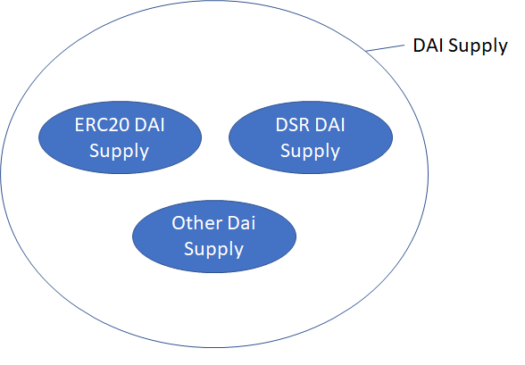

# Tracking Dai Supply

Level: Intermediate

Estimated Time: 20 minutes

## Overview

Dai diverges from the other Ethereum tokens in the sense that it is more than an
ERC-20 token. The Maker Protocol was designed modularly, which allows Dai to
take multiple forms. That poses a challenge for token analysis and crypto
trackers because looking at ERC-20 supply and transactions does not provide a
complete picture

## Learning objectives

Understand the difference between Protocol, ERC20 and DSR Dai, and know the
methods to determine the total supply.

## Pre-requisites

Some knowledge of Ethereum and ERC20 and of Nodejs to run the code samples.

## Content

### The different states of Dai

Contrary to most tokens available on Ethereum, Dai can take different forms. To
correctly account for the Dai supply, it is important to know the difference so
we can track the applicable supply number for our needs.



#### Maker Protocol Dai, or internal-Dai

At its most basic form, Dai is a balance assigned to an address in
[the `vat` contract](https://github.com/makerdao/dss/blob/master/src/vat.sol#L53).
The `vat` contract allows Dai to move from one address to the other, akin to an
ERC-20 token, using the `move` method. It even has a basic permission mechanism,
equivalent to the ERC-20’s `approve`, in the form of the functions `hope` and
`nope`.

Internal-Dai could be used to transact between arbitrary addresses, but it lacks
the functionality one would expect from a token standard, hence the need for a
higher-level contract to wrap the internal-Dai into a more useful form.

#### ERC-20 Dai

Almost every Ethereum token follows the ERC-20 standard, and as such it was
natural for Dai to be available on this form.

When a user wants to put its internal-Dai into an ERC-20, the following steps
are executed:

- The internal-Dai balance is moved to the Dai Adaptor Contract
- The Dai Adaptor Contract instructs the Dai Token Contract to mint ERC-20 to
  the benefit of the user

After this change, the user’s internal-Dai balance becomes 0, the Dai Adaptor
Contract internal-Dai balance increases, and the user’s ERC20 Dai balance
increases.

As such, every ERC-20 Dai is backed by exactly one internal-Dai. We could
represent ERC-20 Dai as a wrapped internal-Dai.

#### DSR Dai

DSR Dai differs from the other two types of Dai in the sense that it is not
directly transferable. What we refer to DSR Dai is a Dai balance held inside
[the `pot` contract](https://docs.makerdao.com/smart-contract-modules/rates-module/pot-detailed-documentation).

When a user activates DSR on its Dai:

- The users’ ERC-20 Dai is burned and he receives an internal-Dai balance
- The internal-Dai is moved to the `pot` contract
- `pot` now has an internal-Dai balance
- User holding is recorded by the `pot` contract. (the `pie`)

#### Other Dai

There are on the market other Dai types (zkDai, Chai, cDAI, aDai, etc.), which
usually derive from either the DSR Dai or the ERC 20 Dai. Since the supply of
these tokens are already included in the total "Maker Protocol Dai" it is not
necessary to add their supply to the total.

Also, Dai can be purely internal: anyone can hold its Dai in Internal form, and
burn and mint ERC20 Dai when necessary. The Maker Protocol itself keeps
internal-Dai balances for its System Surplus and System Debt.

### How to obtain supply numbers

#### Total Maker Protocol Dai, or internal-Dai

As all Dai originates from vault debt, the total supply of Dai can be tracked by
looking at the total system debt on the vat contract. The following code snippet
will provide the information. (Requires node.js and
[web3](https://web3js.readthedocs.io/) module.)

```
const Web3 = require('web3');
const web3 = new Web3('https://mainnet.infura.io/v3/<INFURA_ID>');

const vatAddr = '0x35D1b3F3D7966A1DFe207aa4514C12a259A0492B';
const abi = [{
  "inputs": [],
  "name": "debt",
  "outputs": [{"internalType": "uint256", "name": "", "type": "uint256"}],
  "type": "function"
}];

const vat = new web3.eth.Contract(abi, vatAddr);
vat.methods.debt().call().then(
  supply => console.log(supply/Math.pow(10,45))
);
```

Alternatively, the following API will provide up-to-date information:
[https://api.oasis.app/v1/supply/dai](https://api.oasis.app/v1/supply/dai)

Example:

```
{"data":"111631238.864389825196224371","time":"2020-02-06T15:08:52.088Z","message":"success"}
```

#### ERC20 Dai

The supply of ERC20 Dai is obtained by `totalSupply()`, like all ERC20 tokens.

Note: The ERC20 Dai supply can be less than half of the actual Dai supply. For
most applications, it is more useful to track the total Maker Protocol Dai
(above).

```
const Web3 = require('web3');
const web3 = new Web3('https://mainnet.infura.io/v3/<INFURA_ID>');

const erc20daiAddr = '0x6B175474E89094C44Da98b954EedeAC495271d0F';
const abi = [{
  "inputs": [],
  "name": "totalSupply",
  "outputs": [{"name": "", "type": "uint256"}],
  "type": "function"
}];

const erc20dai = new web3.eth.Contract(abi, erc20daiAddr);
erc20dai.methods.totalSupply().call().then(
  supply => console.log(supply/Math.pow(10,18))
);
```

#### DSR Dai

The Dai in DSR can be calculated by looking at the normalized Dai put in the pot
DSR contract (`Pie`), multiplied by the accumulated rate (`rate`). This number
includes the Dai deposited in DSR and the accrued savings rate.
[Dai.js](https://github.com/makerdao/dai.js/wiki/Multi-Collateral-Dai-Examples)
provides the method `getTotalDai()` to directly obtain the amount of Dai in DSR:

```
const Maker = require('@makerdao/dai');
const McdPlugin = require('@makerdao/dai-plugin-mcd').default;

(async function () {
  const maker = await Maker.create('http', {
    url: "https://mainnet.infura.io/v3/<INFURA_ID>",
    plugins: [
      [McdPlugin, {}]
    ]
  });
  console.log((await maker.service('mcd:savings').getTotalDai()).toNumber());
})();
```

You can learn more about how rates are calculated in the Maker Protocol
[in this guide](https://github.com/makerdao/developerguides/blob/master/mcd/intro-rate-mechanism/intro-rate-mechanism.md).

## Next steps

- [DSR Integration Guide](https://github.com/makerdao/developerguides/blob/master/dai/dsr-integration-guide/dsr-integration-guide-01.md)
- [Intro to the Rate mechanism](https://github.com/makerdao/developerguides/blob/master/mcd/intro-rate-mechanism/intro-rate-mechanism.md)
- [MCD Docs: Rates Module](https://docs.makerdao.com/smart-contract-modules/rates-module)
- [MCD Docs: Dai Module](https://docs.makerdao.com/smart-contract-modules/dai-module)
- [Maker Protocol 101](https://docs.makerdao.com/maker-protocol-101)

## Resources

- [Web3.js](http://web3js.readthedocs.io/)
- [Dai.js](https://github.com/makerdao/dai.js/wiki/Multi-Collateral-Dai-Examples)
